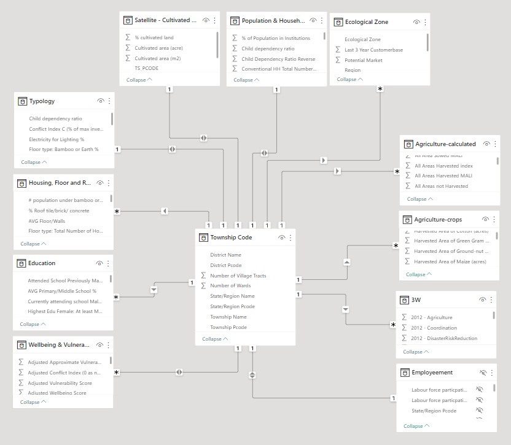
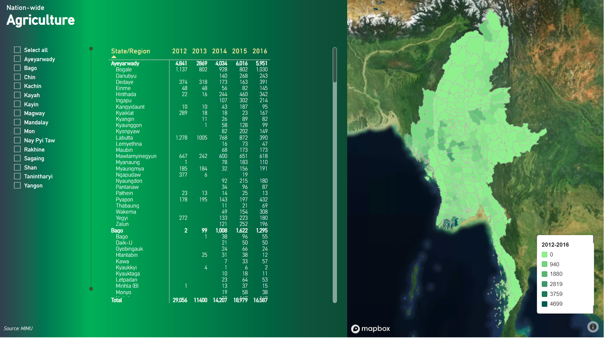
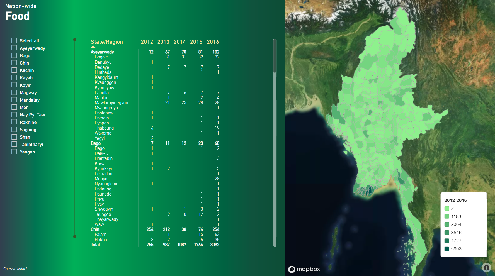
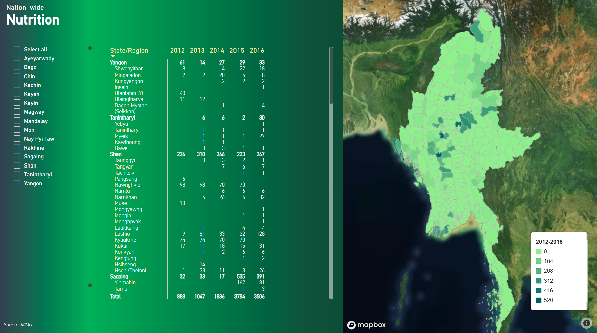
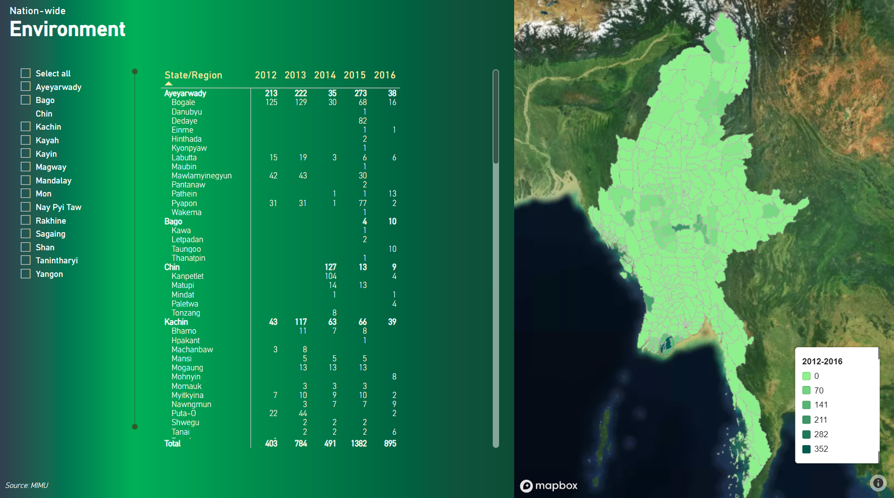

# Background

This project aims to leverage a vast array of data collected from various international non-governmental organizations (INGOs), non-governmental organizations (NGOs), and social impact organizations actively involved in humanitarian and peace-focused initiatives in Myanmar. The project will specifically concentrate on data related to nutrition, food, agriculture, and environmental projects.

> The core objective of this project is to harness the existing data and transform it into an engaging and comprehensive interactive report. The primary goal of this dashboard is to provide valuable insights and facilitate a better understanding of the ongoing efforts in Myanmar regarding nutrition, food security, sustainable agriculture, and environmental conservation. By visualizing the data in an interactive and user-friendly manner, this report intends to empower stakeholders, policymakers, and the public with actionable information.

# Project Deliverables

- Dashboard: Livelihoods in Myanmar - Nutrition_Food_Agriculture [(Click HERE)](https://bit.ly/3BWMTrZ)

# Data Prepration
To achieve the aforementioned objective, the interactive report will encompass the following key elements:

Data Compilation: Extensive data collection will be undertaken from a diverse range of INGOs, NGOs, and social impact organizations working in Myanmar. This data will include information on various projects, interventions, outcomes, and impacts related to nutrition, food, agriculture, and the environment.

Data Analysis: A thorough analysis of the collected data will be conducted to identify patterns, trends, and key insights. This analysis will help uncover the effectiveness of different projects, evaluate their impact on the target communities, and highlight any gaps or areas that require further attention.

Visualizations: The report will utilize a range of visualizations, such as charts, graphs, maps, and infographics, to present the data in a visually appealing and easily understandable format. These visual representations will enable users to quickly grasp the information and draw meaningful conclusions.

Interactivity: The interactive nature of the report will allow users to explore the data according to their specific interests and requirements. Users will have the ability to filter the data based on different parameters, compare various projects, and access detailed information by interacting with the visual elements. 

# Data Sources
The data sources I've included are:

- Ref: MIMU Datasets [(See More)](https://themimu.info/baseline-datasets)
- Ref: MIMU 5W Overview Dashboard [(See More)](https://themimu.info/5w-overview-dashboard)
- Ref: MIMU 5W Village Tract Dashboard [(See More)](https://themimu.info/5W_Dashboard_by_Village_Tract)
- Ref: National Sector, Sub-sectors Description [(See More)](https://bit.ly/41ZTrAu)

# Dashboard [(See More)](https://bit.ly/3BWMTrZ)

> This tab offers a comprehensive overview of agriculture-related projects throughout Myanmar, shedding light on the diverse range of initiatives aimed at improving agricultural practices, increasing food production, and enhancing sustainable farming methods. [(See More)](https://bit.ly/41ZTrAu)

> This tab is specifically designed to highlight the diverse range of food security-related projects across Myanmar. It serves as a comprehensive repository of information, providing an in-depth analysis of initiatives aimed at addressing food security challenges throughout the country. [(See More)](https://bit.ly/41ZTrAu)

> This section of the dashboard will specifically focus on nutrition-related projects implemented across Myanmar. It aims to provide a detailed overview of the initiatives undertaken to address nutritional challenges and improve the well-being of the population. [(See More)](https://bit.ly/41ZTrAu)

This section of the interactive dashboard will specifically highlight environmental-related projects implemented throughout Myanmar. The purpose is to shed light on initiatives that promote environmental conservation, sustainable practices, and the protection of natural resources in the country. [(See More)](https://bit.ly/41ZTrAu)